# AAP Pre-reqs

At the end state, the following environment variables must be set to deploy AAP (example values provided below). This document provides screenshots to show how each of these values are retrieved.

```bash
export RHN_USERNAME="glennchia-hashi"
export RHN_PASSWORD="some_password"
export RHSM_ALLOCATION_UUID="7f4075b9-38ac-46e3-986d-bf481d1853be" #subscription allocation uuid https://access.redhat.com/management/subscription_allocations
export RHSM_OFFLINE_TOKEN="some_offline_token" #subscription offline token https://access.redhat.com/management/api expires with 30 days inactivity
export RHN_REGISTRY_SVC="16723312|svc-registry" #registry service account https://access.redhat.com/terms-based-registry/
export RHN_REGISTRY_TOKEN="ey---------"
export AAP_ADMIN_PASSWORD="Hashi123!" #Ansible Automation Platform admin password. Set your own password.
export HUB_OFFLINE_TOKEN="ey..." #Automation Hub offline token https://console.redhat.com/ansible/automation-hub/token
```

# 1. Partner connect

Already have a RedHat account. In the screenshot below, the username is `glennchia-hashi`. This maps to `RHN_USERNAME`. Use the same password as the one used to login.

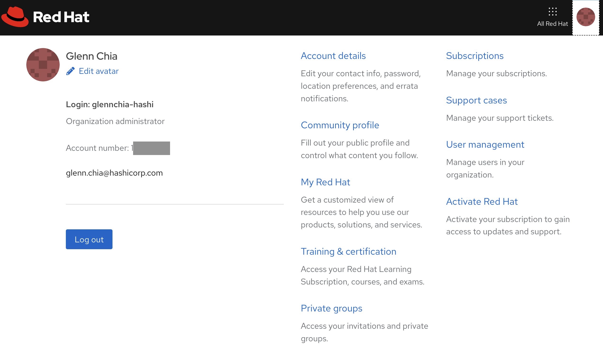

Sign up for Red Hat Partner Connect - https://connect.redhat.com/partner-apps/subscriptions

Accept terms and conditions


Agree to terms and Submit

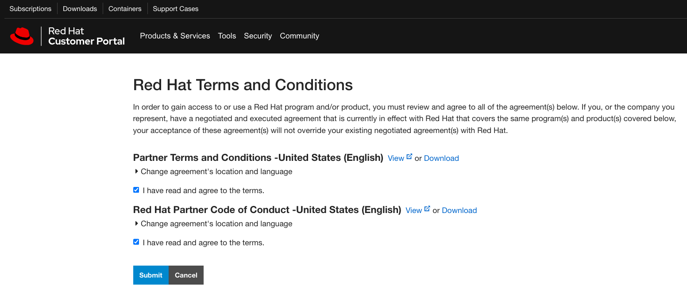

Choose `Demo and/or POC` and choose `Review Terms and Conditions`


Agree to Partner Subscription Terms

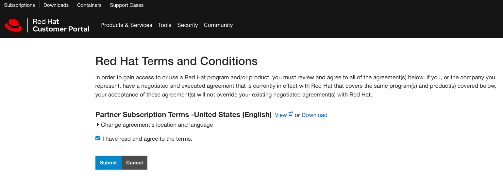

This leads back to the same page as before. Choose `Demo and/or POC` and choose `Review Terms and Conditions`


Confirmation page that the `Red Hat Partner Subscription has been activated`


Refreshing the page shows the `Partner Subscription Already Activated`


Viewing current partner subscriptions shows the subscription start and end date


# 2. Create a new subscription allocation

> [!NOTE]
> After signing up for Partner Connect, you may need to wait a few minutes before creating a new subscription allocation. If you encounter errors, please wait and try again as permissions need time to fully activate.

Enter https://access.redhat.com/management/subscription_allocations and choose `Create New subscription allocation`

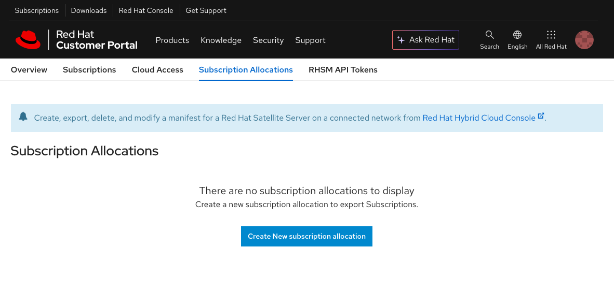

Choose the latest Satellite version for `Type`

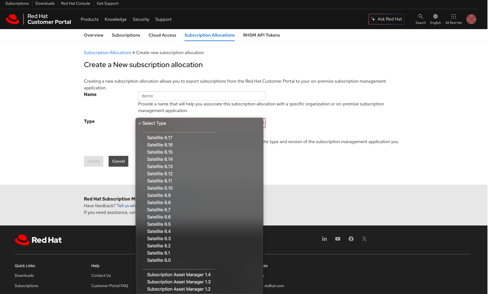

Details filled in for `Create a New subscription allocation`


Subscription allocation details. `UUID` is used for `RHSM_ALLOCATION_UUID`.

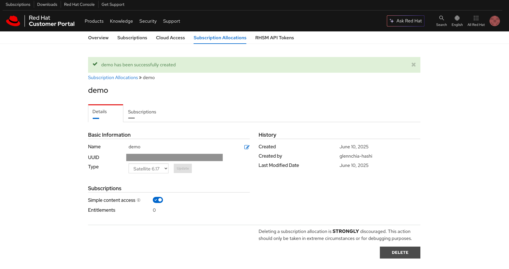

# 3. Offline token generation

Enter https://access.redhat.com/management/api and choose `GENERATE TOKEN`


Copy the offline token. This is used for `RHSM_OFFLINE_TOKEN`

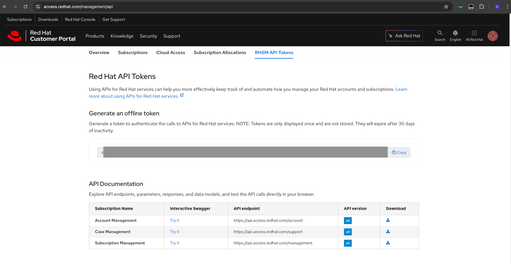

# 4. Registry Service Account

Enter https://access.redhat.com/terms-based-registry/ and choose `New Service Account`


Enter a registry name. Take note of the number and name on this page. This is used for `RHN_REGISTRY_SVC`. The value of the `RHN_REGISTRY_SVC` environment variable follows this format: `<replace-with-number>|<replace-with-name>`. For example: `11112222|svc-registry`.

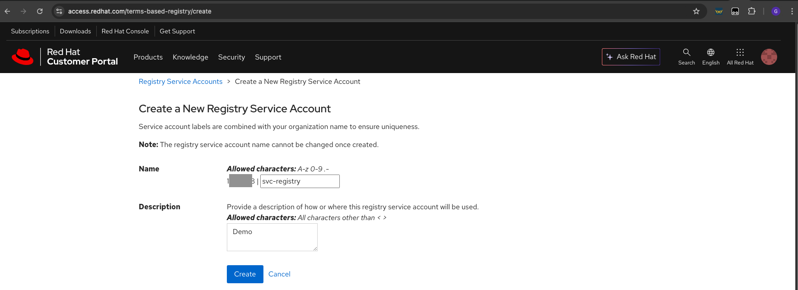

Registry service account created. Click the account name

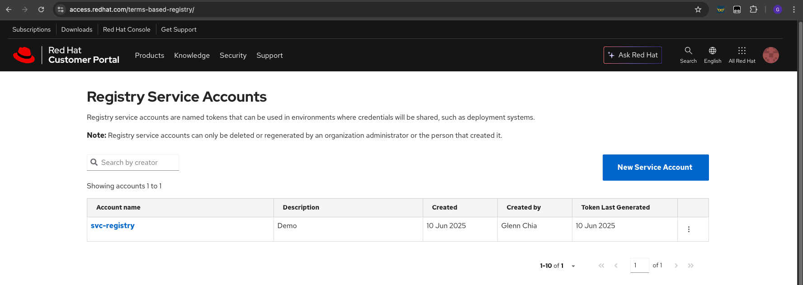

This displays the token information. Copy this token. This is used for `RHN_REGISTRY_TOKEN`

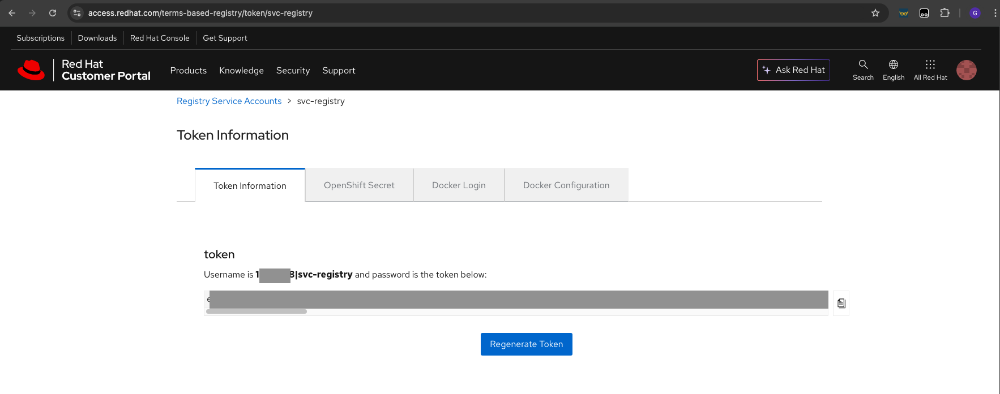

# 5. Hub offline token

Enter https://console.redhat.com/ansible/automation-hub/token and under `Offline token` choose `Load token`

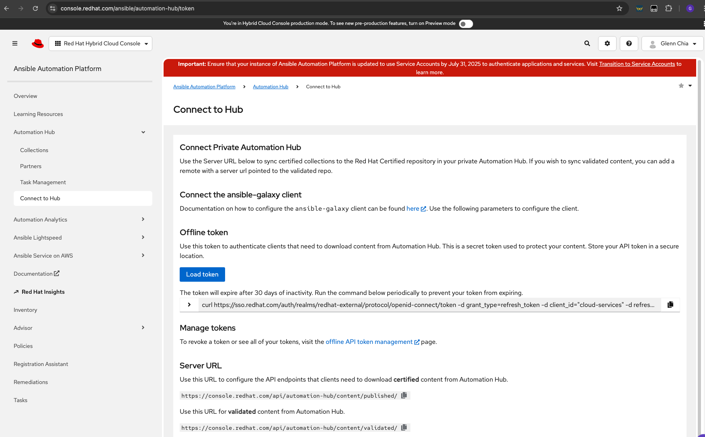

This displays the offline token. Copy the offline token. This is used for `HUB_OFFLINE_TOKEN`

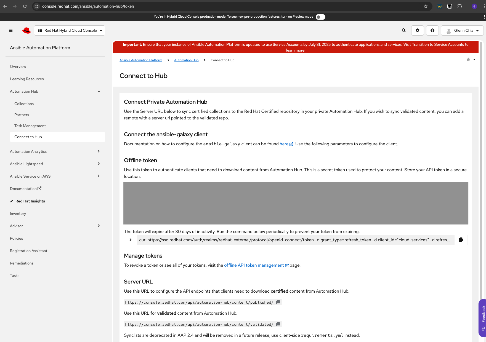
